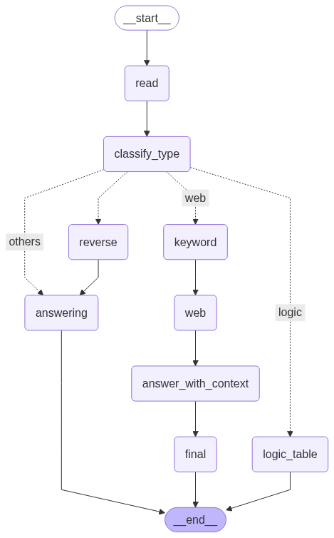

# Hugging Face AI Agent Challenge

🎯 This repository documents my progress and learning from the [Hugging Face AI Agent course](https://huggingface.co/learn/agents) as part of a self-imposed June challenge.  
🧠 The goal: complete the course and obtain certification before July 1st, 2025.

> The challenge has been completed in June 18, 2025.

---

## 📝 Summary

The certification program requires students to build an agent to pass at least 6 out of 20 questions chosen from GAIA Level 1.
I implement a LangGraph-based agent to support web search and navigation. The angent can correctly answer most of the questions about web searching and reach 50% accuracy on the GAIA Level 1 test.

---

## 💡 Why I'm Doing This

This challenge is part of my preparation for graduate school applications (AI track).  
It strengthens my understanding of **agent-based systems**, tools like **Transformers Agents**, and prepares me for deeper AI system integration projects this summer.

---

## 🧑‍💻 Maintainer

GitHub: [omei-lab](https://github.com/omei-lab)  
This project is part of a broader research/development portfolio focused on AI-assisted systems.
